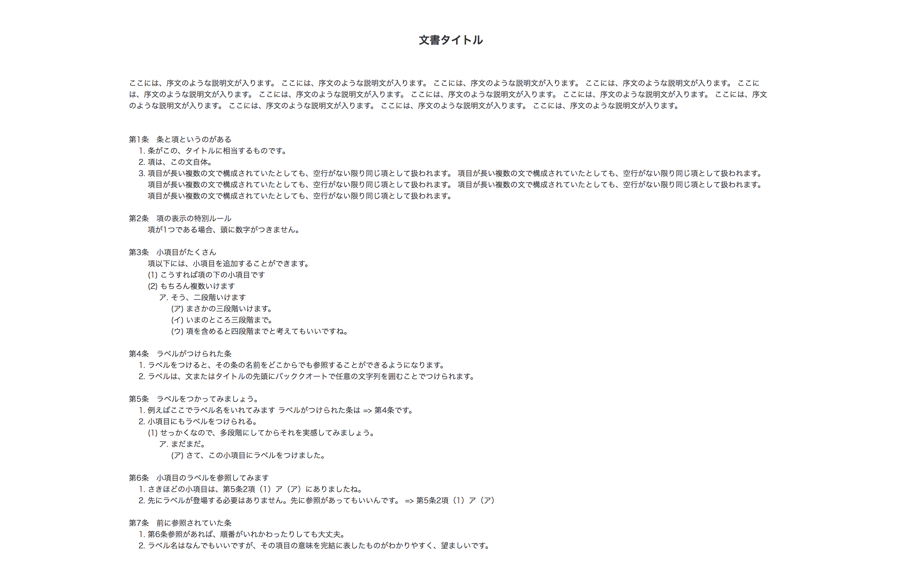

# 公文書、規則メーカー
公文書や規則用の目的で記載したMarkdown形式のテキストを、公文書のスタイルの整ったHTMLに変換します。

# サンプル文書
[デモページ](https://cureapp.github.io/ordinance-format-jp/example.html)



# インストール
```sh
npm install -g ordinance-format-jp
```

# 使い方
## 標準出力にHTMLを出力する場合
```sh
ordinance-format-jp <markdown file>
```

## ブラウザで使用する場合
```js
import { format } from 'ordinance-format-jp'

const formatedText = format(<markdownText to format>, { standalone: true, elementId: 'corp-site-pp'})
```
'formatedText'に、整形され、さらにstyleの当てられているHTMLが出力されます。

## JavaScript API
```js
const ordinanceFormatJp = require('ordinance-format-jp')
const markdownText = require('fs').readFileSync('/path/to/somefile.md', 'utf8')
const html = ordinanceFormatJp(markdownText, { standalone: true, elementId: 'foo-bar' }) // rendered html
```

# オプション
- `--nostyle`: styleタグをつけず、HTML構造のみ出力します。
- `--elementId <elementId>`: トップレベルのdivタグのid名です。

# Markdownの記載ルール
- 文書のタイトル ```#```
- 前文
  - タイトルの後に書かれた文章はそのままの文章で出力されます。

```md
# 文書タイトル
ここには、序文のような説明文が入ります。 ここには、序文のような説明文が入ります。 ここには、序文のような説明文が入ります。 ここには、序文のような説明文が入ります。
```
- 条 ```##```
- 項
  - 項が１つである場合、順番はつきません。
  - 複数存在する場合は、各項の先頭に ```数字.``` と記述すると上から順に項番がふられます。
  - １行改行した場合も番号がふられ出力されます。
  - ```-```では出力されず、数字でのリスト構造のみ出力可能です。
  - 数字でのリスト構造を用いる場合は改行をしないでください。
  - 入れ子にすることにより、より項の中に項が入れ子に出力出来ます。

```md
## 条と項というのがある
項以下には、小項目を追加できます。
  24. こうすれば項の下の小項目です
  5. もちろん複数いけます
    1. そう、二段階いけます
      1. まさかの三段階いけます。
      1. いまのところ三段階まで。
      1. 項を含めると四段階までと考えてもいいですね。
```
- ラベルと参照
  - ラベルと参照機能は、各条項の頭にラベルとしてキーを設定し、同じキーを各条項の文中に用いることで参照することができる機能です。
  - ラベル、参照いずれも ``` `someKey` ``` で利用できますが、文頭で参照したい場合は必ず ``` `$someKey` ``` のようにキーの頭に ```$``` をつけてください。

```md
## `ラベル名` ラベルがつけられた条
ラベルをつけると、その条の名前をどこからでも参照することができるようになります。

ラベルは、文またはタイトルの先頭にバッククオートで任意の文字列を囲むことでつけられます。

## ラベルをつかってみましょう。
例えばここでラベル名をいれてみます ラベルがつけられた条は => `ラベル名`です。

小項目にもラベルをつけられる。
  1. せっかくなので、多段階にしてからそれを実感してみましょう。
    1. まだまだ。
      1. `小項目のラベル` さて、この小項目にラベルをつけました。

## 小項目のラベルを参照してみます
さきほどの小項目は、`$小項目のラベル` にありましたね。
```

- 補足情報
  - 住所や電話番号など補足情報として出力出来ます。
- タイムスタンプ
  - 以下の例のように書くことによって、ユーザーが指定したタイムスタンプを出力出来ます。
  ~~~markdown
   ``` Date　```
  ~~~
- 他のリンクや強調、インライン表現などはMarkdownと同じように利用出来ます。

~~~markdown
## ちょっとしたテクニック
[リンク](https://github.com/CureApp/ordinance-format-jp)、**強調**といったインライン表現は、
Markdownと同じようにつけることができます。

住所や電話番号といった補足情報を入れることができます。
> 補足情報です。
> ちょっとインデントが加わるので、補足情報を書くのにいいです。

```
作成日: 2017年7月23日
変更日: 2017年7月23日
```
~~~

# Contibution
1. Forkする
2. あなたの考えていることをIssueに立てる
3. あなたの考える機能を実装するブランチを作る
4. 変更をコミットする
5. あなたの実装したブランチをPushする
6. Pull Requestを送る

# LICENSE
[Apache-2.0](https://github.com/CureApp/ordinance-format-jp/blob/master/LICENSE)
